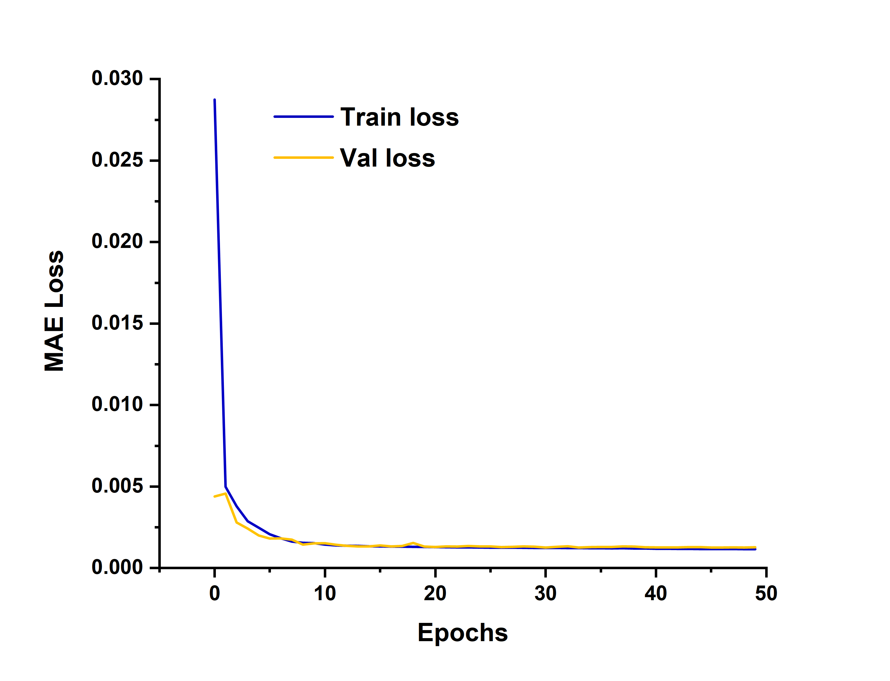

# 🧪 SABRE 信号去噪神经网络

[](https://pytorch.org/)
[](https://opensource.org/licenses/MIT)

基于U-Net架构的1D卷积神经网络，用于提升仲氢诱导超极化（SABRE）技术的NMR信号质量。本方案通过深度学习有效降低检测限，提升信噪比3-5倍。

## 📦 安装
```bash
# 克隆仓库
git clone https://github.com/kimariyb/SABRE-Denoise.git
cd SABRE-Denoise

# 安装依赖
pip install -r requirements.txt
```

## 🚀 快速开始
```python
from model.sabre import SabreNet
from model.dataset import SABREDataset

# 初始化模型
model = SabreNet()

# 加载示例数据
dataset = SABREDataset(root='./data/train')
train_loader = DataLoader(dataset, batch_size=32, shuffle=True)

# 训练示例（完整训练脚本见sabre_train.py）
for raw, label in train_loader:
    pred = model(raw)
    loss = F.l1_loss(pred, label)
    loss.backward()
```

## 🏗 项目结构
```
SABRE-Denoise/
├── sabre_train.py       # 主训练入口
├── sabre_module.py      # Lightning模型定义
├── model/
│   ├── sabre.py         # U-Net网络结构
│   └── dataset.py       # 数据预处理管道
├── data/                # 训练数据目录
│   └── train/          
│       ├── raw/         # 原始CSV数据
│       └── processed/   # 预处理后的.npy数据
└── utils/               # 辅助工具
    ├── args.py          # 命令行参数解析
    ├── losses.py        # 自定义损失函数
    └── splitter.py      # 数据集划分逻辑    
```

## ⚙️ 训练参数
| 参数 | 类型 | 默认值 | 说明 |
|------|------|--------|-----|
| `--lr` | float | 1e-3 | 基础学习率 |
| `--batch-size` | int | 32 | 训练批次大小 |
| `--epochs` | int | 50 | 训练总轮数 |
| `--loss-type` | str | mae | 损失函数类型（MAE/MSE/Huber）|
| `--num-workers` | int | 6 | 数据加载线程数 |
| `--early-stopping` | int | 20 | 早停耐心值 |

## 📊 性能表现

*图1：典型训练过程的损失曲线*

## 📝 数据准备
- 原始 CSV 数据存放于 `data/train/raw/` 目录下，运行 `sabre_train.py` 前请确保数据格式正确。
- 测试数据请放置在 `data/test/raw/` 目录下。

## 🛠 训练
```bash
python sabre_train.py --lr 0.001 --batch-size 32 --epochs 50 --loss-type mse
```

训练完成后，模型权重将保存在 `logs/.../checkpoints` 目录下。

## 🧪 测试
```bash
python sabre_train.py --task test
```

测试结果将保存在 `logs/.../spectra` 目录下。


## 📜 引用
如果您在研究中使用了本项目，请引用：
```bibtex
@software{SABRE-Denoise,
  author = {YuBin Xiong},
  title = {SABRE Signal Denoising Framework},
  year = {2024},
  publisher = {GitHub},
  journal = {GitHub repository},
  howpublished = {\url{https://github.com/kimariyb/SABRE-Denoise}}
}
```

## 📄 许可证
本项目基于 [MIT License](LICENSE) 授权。

        