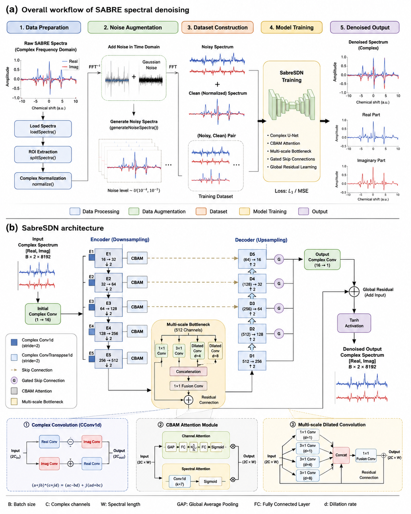
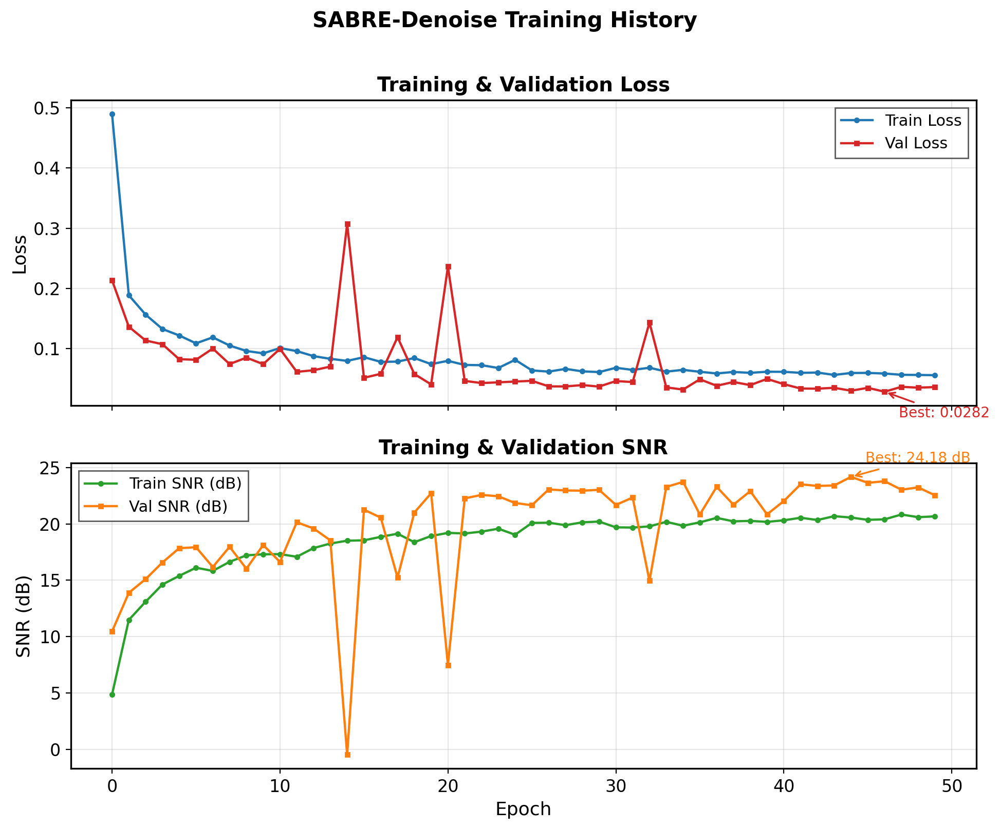
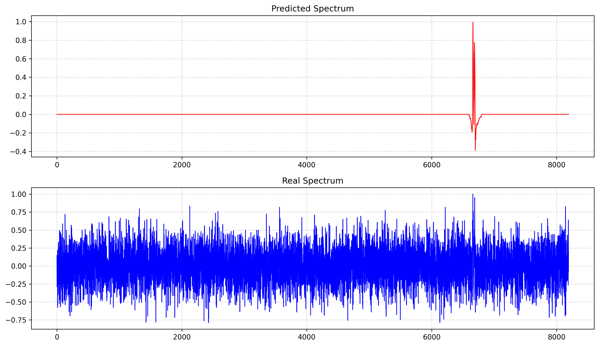

# 🧪 SABRE-Denoise — 复数域 U-Net NMR 信号去噪

[](https://pytorch.org/)
[](https://opensource.org/licenses/MIT)

基于**复数 1D U-Net**架构的深度学习框架，用于提升仲氢诱导超极化（SABRE）技术的 NMR 信号质量。通过在复数域对 NMR 谱图进行端到端学习，有效抑制噪声，信噪比提升 **3–5 倍（最高 +24 dB）**。

## ✨ 特性

- **复数域卷积网络** — 在复数域（实部 + 虚部）进行卷积运算，完整保留 NMR 信号的相位信息
- **注意力增强 U-Net** — 编码端集成 CBAM1d（通道注意力 + 谱峰位置注意力），提升峰区域重建质量
- **多尺度瓶颈层** — 空洞卷积多尺度聚合（dilation=1, 4, 8），同时捕获局部细节和全局上下文
- **门控跳跃连接** — 解码端使用可学习的门控机制，自适应融合编码器特征
- **频域感知损失** — 结合时域 L1 损失、频域幅度一致性损失和基线平滑正则，兼顾重建精度与谱图平滑度
- **自动化训练管线** — 完整的预处理 → 训练 → 推理流程，支持早停、学习率调度、梯度裁剪

## 📦 安装

```bash
# 克隆仓库
git clone https://github.com/kimariyb/SABRE-Denoise.git
cd SABRE-Denoise

# 安装依赖
pip install -r requirements.txt
```

## 🏗 项目结构

```
SABRE-Denoise/
├── src/                      # 核心源代码
│   ├── main.py               # 训练入口
│   ├── models.py             # 复数 U-Net 网络结构
│   ├── trainer.py            # 训练 / 验证循环
│   ├── dataset.py            # 数据集与数据预处理
│   ├── preprocess.py         # 数据预处理流程（CSV → NPZ）
│   ├── inference.py          # 推理管线
│   ├── test_sim.py           # 测试集推理与可视化
│   ├── visual.py             # 训练日志可视化工具
│   └── utils.py              # 辅助函数（损失函数、SNR 计算等）
├── data/                     # 数据目录
│   ├── train/                # 原始训练 CSV 数据
│   │   └── raw/              # （可选）原始 CSV 文件
│   └── train.npz             # 预处理后的训练数据
├── checkpoints/              # 模型权重保存目录
│   ├── best_model.pth        # 最佳模型
│   ├── final_model.pth       # 最终模型
│   └── epoch_*.pth           # 各 epoch 检查点
├── logs/                     # 日志与可视化结果
│   ├── training_log_*.csv    # 训练日志
│   ├── training_curves.png   # 训练曲线图
│   └── saved_*.png           # 推理光谱对比图
├── inference/                # 推理输入 CSV 数据目录
├── requirements.txt          # Python 依赖
└── README.md
```

## 🧠 网络架构

### SabreSDN（SABRE Signal Denoising Network）

整个网络以复数 NMR 谱图（实部 + 虚部，形状 `[B, 2, 8192]`）为输入和输出，核心是 **SDNBlock**（U-Net 骨架）




### 核心模块

| 模块 | 说明 |
|------|------|
| `CConv1d` / `CConvTranspose1d` | **复数卷积**：将实部/虚部视为独立通道，计算 `(a+jb)∗(c+jd) = (ac−bd) + j(ad+bc)` |
| `CBAM1d` | **1D 卷积注意力**：串联通道注意力（SE-Net 风格）与谱峰位置注意力 |
| `ChannelAttention` | SE-Net 风格通道注意力，GAP + FC + Sigmoid |
| `SpectralAttention` | 谱峰位置注意力，`Conv1d(7×1)→Sigmoid`，关注峰所在区域 |
| `MultiScaleBlock` | 空洞卷积多尺度聚合（4 分支并行 → 拼接 → 融合），带残差连接 |
| `GatedSkip` | 门控跳跃连接：`Sigmoid(Conv1d([decoder_feat, encoder_feat])) × encoder_feat` |

### 复数卷积设计

传统实数域卷积无法有效处理复数 NMR 信号的实部-虚部耦合关系。`CConv1d` 将实部与虚部分别进行卷积，并利用复数乘法规则交叉组合：

```python
real_out = Conv(real) - Conv(imag)    # 复数乘法实部
imag_out = Conv(real) + Conv(imag)    # 复数乘法虚部
```

这种设计使网络能够学习 NMR 信号的复数域内在结构，比简单堆叠实数卷积更高效。

## 🚀 快速开始

```python
from src.models import SabreSDN

# 初始化模型（~6.3M 参数）
model = SabreSDN(num_blocks=1, use_attention=True, use_gated_skip=True)

# 前向推理
import torch
x = torch.randn(1, 2, 8192)   # [batch, 2(real/imag), length]
y = model(x)                   # → [1, 2, 8192]
print(f"输入: {x.shape} → 输出: {y.shape}")
```

## 📊 性能表现

### 训练曲线



*上：训练/验证 Loss 曲线；下：训练/验证 SNR 曲线。红色箭头标记最佳验证指标。*

### 关键指标（40 Epochs 训练结果）

| 指标 | 初始值（Epoch 0） | 最佳值 | 提升幅度 |
|------|:-:|:-:|:-:|
| **训练损失** | 0.4901 | **0.0557**（Epoch 49） | ↓ 8.8× |
| **验证损失** | 0.2135 | **0.0282**（Epoch 46） | ↓ 7.6× |
| **训练 SNR** | 4.84 dB | **20.87 dB**（Epoch 47） | ↑ 16.0 dB |
| **验证 SNR** | 10.46 dB | **24.18 dB**（Epoch 44） | ↑ 13.7 dB |

- 峰值验证 SNR：**24.18 dB**（Epoch 44）
- 最终模型验证 SNR：**22.54 dB**
- 信噪比提升约 **3–5 倍**

### 推理结果示例


*上：模型预测的降噪谱图；下：真实纯净谱图。峰区域集中在 6600–6800 采样点。*

## 🛠 数据准备

原始 NMR 谱图数据为 CSV 格式，每行包含化学位移、实部、虚部三列。**`preprocess.py`** 完成以下流水线：

```
CSV 原始谱图
  → loadSpectra()       读取 CSV，解析为复数数组
  → splitSpectra()      截取感兴趣区域（默认 41308–49500）
  → normalize()          归一化到 [-1, 1]
  → generateNoiseSpectra()  添加高斯白噪声（噪声水平随机采样）
  → 输出 train.npz
```

```bash
cd src
python preprocess.py
```

参数配置（`preprocess.py` 底部）：

| 参数 | 默认值 | 说明 |
|------|--------|------|
| `csv_root` | `../data/train/` | 原始 CSV 数据目录 |
| `save_path` | `../data/train.npz` | 预处理输出路径 |
| `split_range` | `(41308, 49500)` | 谱图截取区间 |
| `noise_range` | `(1e-4, 1e-2)` | 噪声强度范围 |
| `pre_count` | 20000 | 每份谱图的噪声样本数 |

## ⚙️ 训练

```bash
cd src
python main.py
```

训练配置（在 `src/main.py` 顶部调整）：

| 参数 | 默认值 | 说明 |
|------|--------|------|
| `DEVICE` | `cuda:0` / `cpu` | 训练设备 |
| `SPECTRA_PATH` | `../data/train.npz` | 训练数据路径 |
| `BATCH_SIZE` | 256 | 批次大小 |
| `EPOCHES` | 50 | 训练总轮数 |
| `LEARNING_RATE` | 1e-3 | 基础学习率 |
| `LR_MIN` | 1e-6 | 最小学习率 |
| `LR_FACTOR` | 0.8 | 学习率衰减因子 |
| `LR_PATIENCE` | 5 | LR 调度器耐心值 |
| `WEIGHT_DECAY` | 1e-3 | AdamW 权重衰减 |
| `GRAD_CLIP` | 1.0 | 梯度裁剪阈值 |

训练过程中：
- 自动记录 `logs/training_log_YYYYMMDD_HHMMSS.csv`
- 验证损失最低的模型保存为 `checkpoints/best_model.pth`
- 每 epoch 保存检查点至 `checkpoints/epoch_N.pth`
- 训练完成后保存 `checkpoints/final_model.pth`

### 自定义损失函数

`utils.py` 中的 `calc_loss` 结合了三项目标：

```python
total_loss = λ_spec * 频域幅度一致性损失
           + λ_peak * 峰区域加权损失（6600–6800 采样点）
           + λ_base * 基线平滑正则（无峰区域抖动抑制）
```
默认权重：`λ_spec=0.1`，`λ_peak=2.0`，`λ_base=0.5`

### 可视化训练曲线

```bash
cd src
python visual.py                          # 自动读取最新日志
python visual.py --log ../logs/training_log_xxx.csv  # 指定日志
python visual.py --save my_curves.png                # 指定保存路径
```

## 🧪 推理与测试

使用训练好的最佳模型对测试谱图进行降噪：

```bash
cd src
python test_sim.py       # 读取 checkpoints/best_model.pth
python inference.py      # 读取 inference/ 目录中的 CSV 文件
```

推理结果（光谱对比图）自动保存至 `logs/saved_*.png`。

### 模型参数量

| 配置 | 参数量 |
|------|:------:|
| `SDNBlock`（默认，6 级通道数） | **~6.3M** |
| `SabreSDN`（1 block） | **~6.3M** |

## 📜 引用

如果您在研究中使用了本项目，请引用：

```bibtex
@software{SABRE-Denoise,
  author = {YuBin Xiong},
  title = {SABRE Signal Denoising Framework — Complex U-Net for NMR Denoising},
  year = {2024},
  publisher = {GitHub},
  journal = {GitHub repository},
  howpublished = {\url{https://github.com/kimariyb/SABRE-Denoise}}
}
```

## 📄 许可证

本项目基于 [MIT License](LICENSE) 授权。
